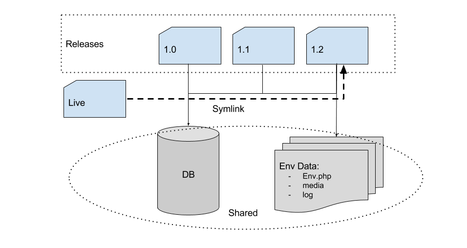
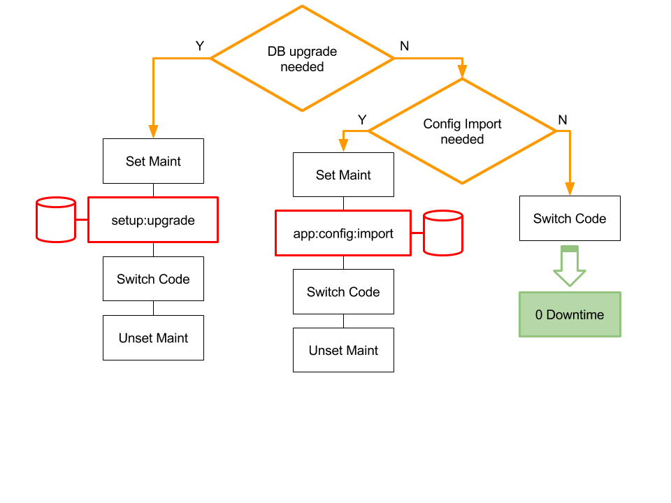
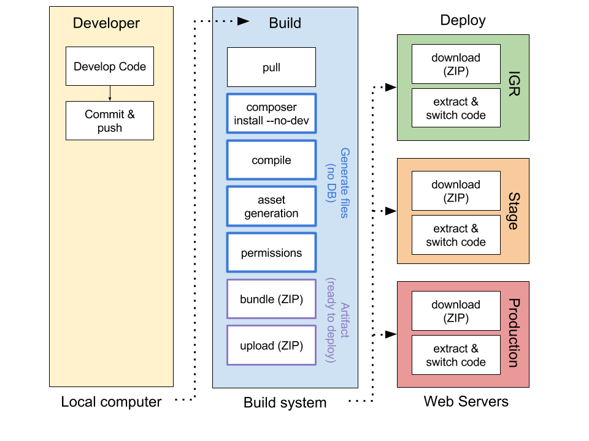
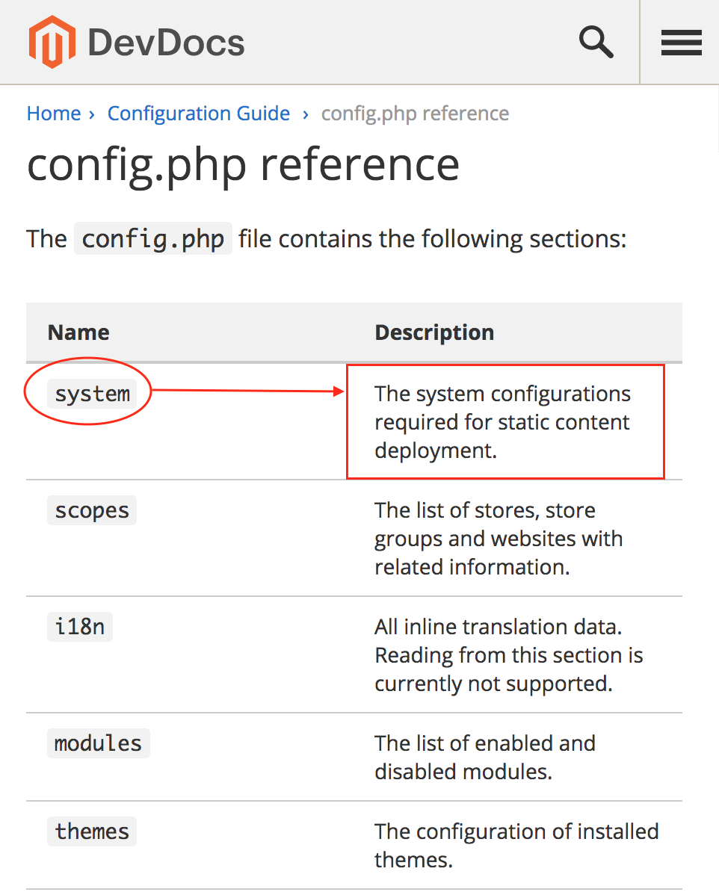
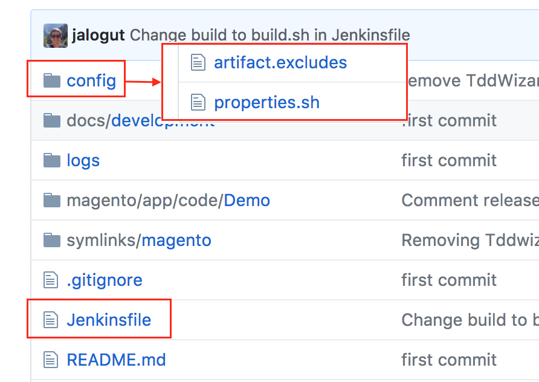

@title[Introduction]
## Fully automated 
## Zero downtime
##### <span style="font-family:Helvetica Neue; font-weight:bold">deployments in <span style="color:#f46f25">Magento 2.2</span></span>

---?image=assets/img/about-me.png
@title[About me]

---
@title[Agenda 0]
## Agenda

* Project Setup
* Wrong deployment
* Right deployment
* Zero Downtime
* Build Pipeline
* CI/CD

---
@title[Agenda 1]
## Agenda

* **Project Setup**
* <span style="opacity: 0.2;">Wrong deployment</span>
* <span style="opacity: 0.2;">Right deployment</span>
* <span style="opacity: 0.2;">Zero Downtime</span>
* <span style="opacity: 0.2;">Build Pipeline</span>
* <span style="opacity: 0.2;">CI/CD</span>

@fa[arrow-down]

+++
@title[Project Setup]

<ul>
<li>git (or another VCS)</li>
<li class="fragment">composer</li>
<li class="fragment">composer.lock in VCS</li>
<li class="fragment">etc/config.php in VCS</li>
<li class="fragment">~~etc/env.php~~  **NOT** in VCS</li>
<li class="fragment">~~vendor~~ **NOT** in VCS</li>
</ul>

+++
@title[Composer Setup Tutorial]
#### Tutorial

<br>

Proper Magento 2 Composer Setup: [https://blog.hauri.me/](https://blog.hauri.me/proper-magento2-composer-setup.html)

+++
@title[Magento 2 Project Example]
#### Example

<br>

[https://github.com/jalogut/magento-2.2-demo](https://github.com/jalogut/magento-2.2-demo)

---
@title[Agenda 2]
## Agenda

* <span style="opacity: 0.2;">Project Setup</span>
* **Wrong deployment**
* <span style="opacity: 0.2;">Right deployment</span>
* <span style="opacity: 0.2;">Zero Downtime</span>
* <span style="opacity: 0.2;">Build Pipeline</span>
* <span style="opacity: 0.2;">CI/CD</span>

@fa[arrow-down]

+++
#### Manually

<br>

[Demo]

+++
#### Cons 👎

<br>

- Waste of time |
- Easy to make mistakes |
- High Downtime: 15min - 30min |

+++
#### Simple Automation

<br>

[Demo]

+++
#### Cons 👎

<br>

- Not reliable |
- High Downtime: 15min - 30min |

---
@title[Agenda 3]
## Agenda

* <span style="opacity: 0.2;">Project Setup</span>
* <span style="opacity: 0.2;">Wrong deployment</span>
* **Right deployment**
* <span style="opacity: 0.2;">Zero Downtime</span>
* <span style="opacity: 0.2;">Build Pipeline</span>
* <span style="opacity: 0.2;">CI/CD</span>

@fa[arrow-down]

+++
@title[Current live]
#### Current live

<br>


+++
@title[Deploying new version]
#### Deploying new version

<br>


+++
@title[Switch symlink]
#### Switch symlink

<br>


+++
@title[Shared Data]
#### Shared Data



+++

@title[Tools]

#### Tools

<br>

- [Deployer (PHP)](https://deployer.org/)
- [Capistrano (Ruby)](http://capistranorb.com/)
- [Shipit-deploy (Node-js)](https://github.com/shipitjs/shipit-deploy)

+++
@title[Demo Right Deployment]

[Demo]

+++
#### Pros 👍

<br>

- Fully automated |
- Reliable |
- Low Downtime: ~20sec |

---
@title[Disclaimer 2.2]
#### Disclaimer

<br>

##### hereafter <span style="font-family:Helvetica Neue; font-weight:bold">only version <span style="color:#f46f25">>= 2.2</span></span>

---
@title[Agenda 4]
## Agenda

* <span style="opacity: 0.2;">Project Setup</span>
* <span style="opacity: 0.2;">Wrong deployment</span>
* <span style="opacity: 0.2;">Right deployment</span>
* **Zero Downtime**
* <span style="opacity: 0.2;">Build Pipeline</span>
* <span style="opacity: 0.2;">CI/CD</span>

@fa[arrow-down]

+++
@title[Skip Maintenance]
#### Skip Maintenance



+++
@title[Commands]
#### Commands

<br>

- setup:db:status
- config:import:status (>=2.2.3)

+++
#### Workaround (config:import:status)

<br>

```bash
bin/magento config:set workaround/check/config_status 1
# Check output == "please run app:config:import"
```

+++
@title[Demo zero downtime]

[Demo]

+++
@title[Zero downtime accomplished]

#### Zero Downtime accomplished!


---
@title[Agenda 5]
## Agenda

* <span style="opacity: 0.2;">Project Setup</span>
* <span style="opacity: 0.2;">Wrong deployment</span>
* <span style="opacity: 0.2;">Right deployment</span>
* <span style="opacity: 0.2;">Zero Downtime</span>
* **Build Pipeline**
* <span style="opacity: 0.2;">CI/CD</span>

@fa[arrow-down]

+++
@title[Build Pipeline]



+++

#### What do we need?

<br>

Config in Build == Servers

+++

#### How?

<br>

Config propagation in files

+++
@title[config.php]



+++

`app:config:dump`


+++

#### Up-Vote PR! 🙌

<br>

- Dump only static: [PR #12410](https://github.com/magento/magento2/pull/12410)

+++

#### Workaround: 

<br>

magento2-config-dump-skip-system.xml: [https://gist.github.com/jalogut/](https://gist.github.com/jalogut/d72e0af6e10c502bff90423e66bf07b9)

+++

[Demo]

+++ 

#### Why?

<br>

- Save CPU during deployment
- Identify files generation issues right away |
- Common bundle to share amongst Servers |
- History for auditing or back in time checks | 

---
@title[Agenda 6]
## Agenda

* <span style="opacity: 0.2;">Project Setup</span>
* <span style="opacity: 0.2;">Wrong deployment</span>
* <span style="opacity: 0.2;">Right deployment</span>
* <span style="opacity: 0.2;">Zero Downtime</span>
* <span style="opacity: 0.2;">Build Pipeline</span>
* **CI/CD**

@fa[arrow-down]

+++

#### Automate

<br>

tests -> builds -> deploys

+++
@title[Jenkins Tutorial]
#### Jenkins tutorial

<br>

Setup Continuos Integration/Delivery system: [https://dev.to/jalogut](https://dev.to/jalogut/setup-continuos-integrationdelivery-system-in-just-4-steps-with-jenkins-pipelines-and-blue-ocean)

+++
#### Files

<br>

- build.sh -> Jenkins
- properties -> git project
- deploy.sh -> Web Servers

+++
#### CD Unique hash

deploy.sh
```bash
TARGET=releases/${VERSION}
if [[ ${VERSION} = "develop" ]]; then
    TARGET=${TARGET}-$(date +%s)
fi
RELEASE=${WORKING_DIR}/${TARGET}
```

+++
@title[Jenkins project example]

[https://github.com/jalogut/magento-2.2-demo](https://github.com/jalogut/magento-2.2-demo)


+++?code=scripts/build-jenkins/Jenkinsfile&lang=groovy&title=Source: Jenkinsfile

@[10,13,16](Get project and execute tests)
@[29,31-32](Build Bundle)
@[33,35-36](Always deploy Develop)
@[40-42](Confirm tag and deploy)
@[49,52,55,57](Confirm and deploy to Stage/Production)

+++
@title[Jenkins Video]


---
@title[Tips]
## Tips! ✍️

@fa[arrow-down]

+++
#### Flush all caches

<br>

OPcache, Varnish, Redis, ...

+++

@title[Composer Tweaks]
#### Speed up Composer

<br>

```
composer install --no-dev --prefer-dist --optimize-autoloader
```

```
composer global require hirak/prestissimo
```

+++
#### Update crontab automatically

cron:install --force

```xml
<type name="Magento\Framework\Crontab\TasksProviderInterface">
    <arguments>
        <argument name="tasks" xsi:type="array">
            <item name="CUSTOM_CRON" xsi:type="array">
                <item name="expression" xsi:type="string">0 3 * * *</item>
                <item name="command" xsi:type="string">{magentoRoot}bin/magento custom:command</item>
            </item>
        </argument>
    </arguments>
</type>
```

+++ 
#### [Static files deployment strategies](http://devdocs.magento.com/guides/v2.2/config-guide/cli/config-cli-subcommands-static-deploy-strategies.html):

- Standard
- Quick
- Compact (up to 10x faster)

**Warning**: I did not test it yet.

+++

#### DB Backup 

<p><span class="menu-title slide-title">deploy.sh</span></p>
```bash
if [[ 1 == ${UPGRADE_NEEDED} ]]; then
  	bin/magento maintenance:enable
  	n98-magerun2 db:dump --compression='gzip' ${WORKING_DIR}/backups/live-$(date +%s).sql.gz
  	bin/magento setup:upgrade --keep-generated
fi
```

---
@title[Issues]
## Issues 🤕

@fa[arrow-down]

+++
#### Local ENV Config

<br>

- Cumbersome Solution: [Dev Docs](http://devdocs.magento.com/guides/v2.2/config-guide/prod/config-reference-var-name.html)
- Configuration by Environment: [PR #12361](https://github.com/magento/magento2/pull/12361)

+++
#### Js translations

<br>

- Still not fixed: [#10673](http://devdocs.magento.com/guides/v2.2/config-guide/prod/config-reference-var-name.html)
- Workaround: <span style="font-size:0.6em; color:gray">run `setup:static-content:deploy` once per language</span>

+++
#### Static deploy options ignored

<br>

Doesn't exclude the theme
```
setup:static-content:deploy -f --exclude-theme=Magento/blank
```

---
## Out-of-the-box Tools

<br>

- [magento2-builder-tool](https://github.com/staempfli/magento2-builder-tool)
- [magento2-deployment-tool](https://github.com/staempfli/magento2-deployment-tool)

Example: [magento-22-mg2-builder](https://github.com/jalogut/magento-22-mg2-builder)

---
@title[Take aways]
## Take Aways

<br>

- Start small, Zero downtime possible w/o build system |
- Build pipeline allows new deployment strategies |
- Pipeline issues, create a PR and be patient (Magento is not perfect) |

–––
@title[Resources]
## Resources

@fa[arrow-down]

+++
#### Magento 2: 

<br>

- Alan Kent - Magento 2.2 deployment:
	- [Video](https://www.youtube.com/watch?v=nIFfn3YHkPs)
	- [Slides](https://info2.magento.com/rs/585-GGD-959/images/The%20New%20Magento%202.2%20Deployment%20Capabilities%20%26%20Patterns.pdf)
- MageDeploy2:
	- [https://dev98.de -> Introducing MageDeploy2](https://dev98.de/2017/03/01/introducing-magedeploy2/)

+++
#### Deployments in General

<br>

- Video course: [DeployPHP](https://deploy.serversforhackers.com/)
	- [https://serversforhackers.com/](https://serversforhackers.com/)

+++
#### This Presentation

- Slides: <span style="font-size:0.6em;">[https://gitpitch.com/jalogut/magento2-deploy-zero-downtime](https://gitpitch.com/jalogut/magento2-deploy-zero-downtime)</span>

- Scripts: <span style="font-size:0.6em;">[https://github.com/jalogut/magento2-deploy-zero-downtime/tree/master/scripts](https://github.com/jalogut/magento2-deploy-zero-downtime/tree/master/scripts)</span>

- Project Example: <span style="font-size:0.6em;">[https://github.com/jalogut/magento-2.2-demo](https://github.com/jalogut/magento-2.2-demo)</span>


---
@title[thank you]

## Thanks

<br>

Feedback & Questions

👇

[@jalogut](https://twitter.com/jalogut)

 